> v2版：根据2026年7月13日阶跃星辰发布会实际内容更新。主要更新项：终端品牌名STEPX、手机型号STEPX Neo、操作系统名Step AOS、内置智能体Amoo、196B端侧模型、交互副屏、生态合作伙伴、安全白皮书、"100天·共同定义智能体乐园"计划、发售信息修正。

---

*内容仅作科普，不构成投资建议*

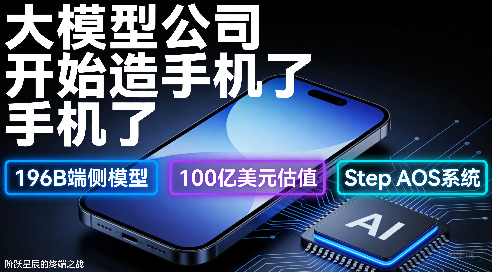

# 大模型公司开始造手机了：阶跃星辰的终端之战

## 一、一个100亿美元的公司，2025年只赚了5亿

2026年7月13日晚7点，一家成立刚满3年的大模型公司，正式发布了全球首款AI智能体手机。不是给安卓系统加个AI助手，而是从零做了一套操作系统——Step AOS。终端品牌命名为STEPX，首款手机型号为STEPX Neo。

这家公司叫阶跃星辰。估值约100亿美元，但2025年营收不到5亿元人民币，PS（市销率）高达140倍。什么概念？你花140块钱买一个每年只赚1块钱的公司，赌的是它未来能赚10块钱。

它凭什么敢造手机？这个故事是泡沫还是拐点？

先说结论：阶跃星辰造手机这件事，**短期内是一场豪赌，但中长期看，它可能是大模型行业从"卖模型"到"卖体验"的分水岭事件。**

要理解这个判断，我们得先把牌桌看清楚——全球大模型的竞争格局，到底长什么样。

---

## 二、大模型牌桌上坐着谁？

### 2.1 全球市场份额：一超多强，但格局在裂开

先看一组硬数据。根据Momentic Marketing和First Page Sage 2026年6月的统计，全球大模型流量市场份额是这样的：

| 排名 | 公司 | 全球流量份额 | 月活跃用户 |
|------|------|-------------|-----------|
| 1 | OpenAI | 54.7% | 9亿+ |
| 2 | Google | 27.4% | 7.5亿+ |
| 3 | Anthropic | 8.2% | 2.9亿+ |
| 4 | 字节跳动（豆包） | 4.1% | 3.45亿 |
| 5 | DeepSeek | 2.9% | 1.2亿+ |
| 6 | 阿里巴巴（通义千问） | 1.5% | 1.66亿 |

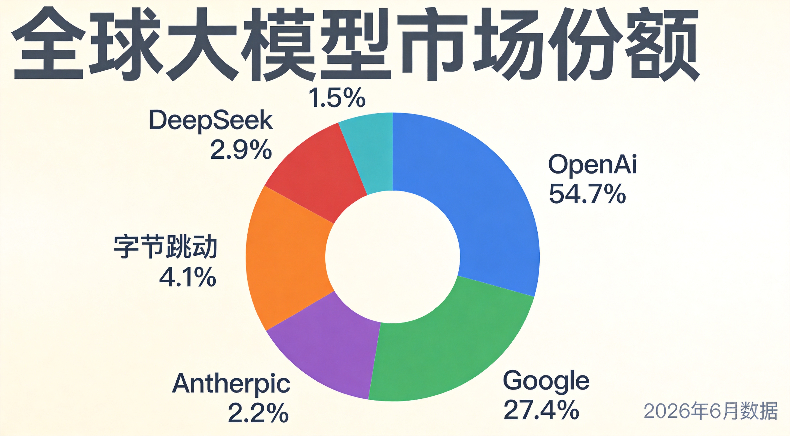

OpenAI依然是绝对霸主，但它的份额已经从巅峰期的80%掉到55%以下。Sensor Tower的数据显示，到2026年5月，ChatGPT的全球份额首次跌破50%，只剩46.4%。Google Gemini吃到了最大的红利，份额稳定在27%以上。Anthropic的Claude从半年前的3%飙到10%左右，增速惊人。

一个重要的结构性变化是：**用户不再忠于单一模型了。** 就像浏览器市场从IE一家独大变成Chrome、Safari、Edge混战一样，AI助手市场正在进入"按需混用"时代——写作用Claude，搜信息用Gemini，画图用ChatGPT。三家合计贡献了89%的使用时长，但用户在各家之间频繁切换。

### 2.2 中国市场：豆包一家独大，但暗流涌动

中国市场的格局完全不同。根据QuestModule 2026年6月的数据：

- **字节豆包**：市场份额41%，月活3.45亿，日活1.4亿——中国AI应用的绝对王者
- **月之暗面Kimi**：中国Token份额第一（14.5%），用户增速最快
- **腾讯元宝**：日活约900万，依托微信生态稳步增长

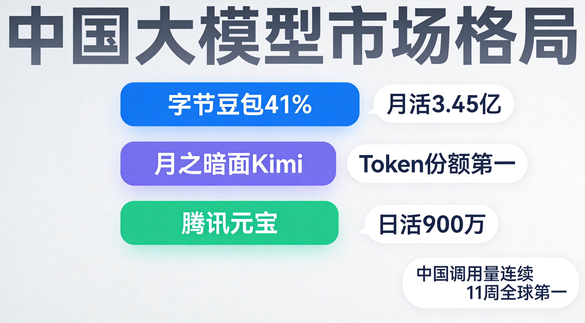

另一个值得关注的信号来自OpenRouter——全球最大的模型调用平台。2026年6月数据显示，中国模型在全球的调用量首次稳定超越美国：23.45万亿词元对46.7万亿词元（全球总调用量），前五名中中国模型占了四席。

这说明什么？**中国大模型在"被调用量"上已经赢了，但还没在"被付费"上赢。** 开源模型的大量免费调用拉高了数据，但真正的高价值企业付费市场，OpenAI和Anthropic仍然遥遥领先。

### 2.3 性能评分大对比：SuperCLUE 2026年6月Top10

这是用户特别关心的部分。我们直接看SuperCLUE 2026年6月的中文大模型排行榜：

| 排名 | 模型 | 机构 | SuperCLUE总分 |
|------|------|------|--------------|
| 1 | Qwen3.5-Plus | 阿里巴巴 | 88.5 |
| 2 | Doubao-Seed-2.0-pro | 字节跳动 | 87.8 |
| 3 | DeepSeek V4-Pro | 深度求索 | 86.5 |
| 4 | GLM-5.1 | 智谱AI | 85.4 |
| 5 | Kimi K2.6 | 月之暗面 | 84.6 |
| 6 | MiniMax M2.7 | MiniMax | 83.2 |
| 7 | ERNIE 5.1 | 百度 | 82.7 |
| 8 | Pangu-Ultra 718B | 华为 | 81.9 |
| 9 | Baichuan 5.0 | 百川智能 | 79.4 |
| 10 | Yi-2.0 | 零一万物 | 78.8 |

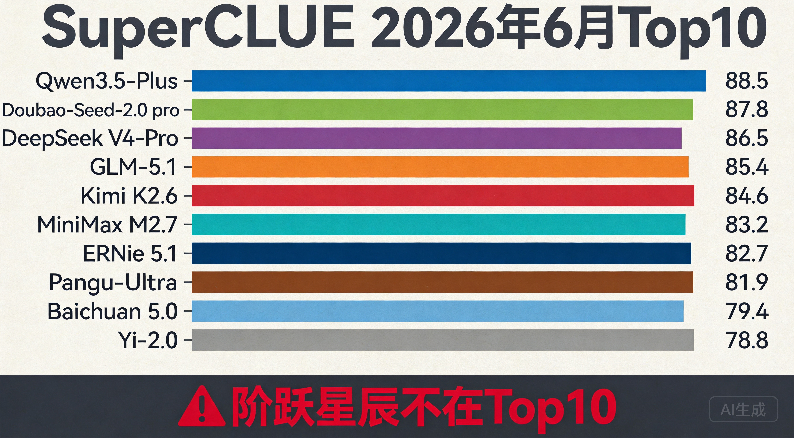

注意看：**阶跃星辰的Step系列不在这个榜单的Top10里。** 这是一个重要的反差叙事点——一家要造手机的大模型公司，它的模型在主流性能排行里甚至进不了前十。

### 2.4 LMArena全球Elo排名：另一个维度的较量

LMArena（原Chatbot Arena）是基于真人匿名A/B投票的全球排名，更能反映"用户实际体感"。2026年7月最新数据：

| 排名 | 模型 | Elo分数 |
|------|------|---------|
| 1 | Claude Fable 5（Anthropic） | 1525 |
| 2 | GPT-5.6（OpenAI） | 1514 |
| 3 | Claude Opus 4.8（Anthropic） | 1512 |
| 4 | GPT-5.5 Pro（OpenAI） | 1510 |
| ... | ... | ... |
| 约第30名 | DeepSeek V4 Pro | 1462（国产最高） |
| 约第35名 | Qwen 3.7 Max | 1455 |

国产模型在全球Elo排名中，DeepSeek V4 Pro以1462分排在国产第一，但与第一名Claude Fable 5的1525分仍有明显差距。阶跃星辰同样不在前列。

### 2.5 关键判断：性能排名≠商业成功

看到这里，你可能会问：一家模型排名都进不了Top10的公司，凭什么造手机？

答案是：**阶跃星辰根本不想在云端跟人卷排名。**

这是一个战略选择，不是能力不足。就像特斯拉早期不跟丰田比发动机调校，而是直接换赛道做电动车一样，阶跃星辰的逻辑是：既然在通用模型能力上很难追上前五，不如把模型能力直接塞进终端设备里，让用户通过"体验"而非"跑分"来感知AI的价值。

跑分是给开发者看的，体验是给普通人用的。这两件事的商业逻辑完全不同。

### 2.6 独角兽估值排名：泡沫还是信仰？

看看中国大模型第一梯队的估值对比：

| 公司 | 最新估值/市值 | PS倍数（约） | 2025年营收 |
|------|-------------|------------|-----------|
| 智谱（港股） | 7312亿港元 | ~700倍 | 7.24亿元 |
| DeepSeek | 3065亿元 | — | 未公开 |
| 月之暗面Kimi | ~2100亿元（300亿美元） | — | ARR约20亿元 |
| MiniMax（港股） | 842亿港元 | ~400倍 | 约5.7亿元 |
| 阶跃星辰 | ~720亿元（100亿美元） | ~140倍 | ~5亿元 |

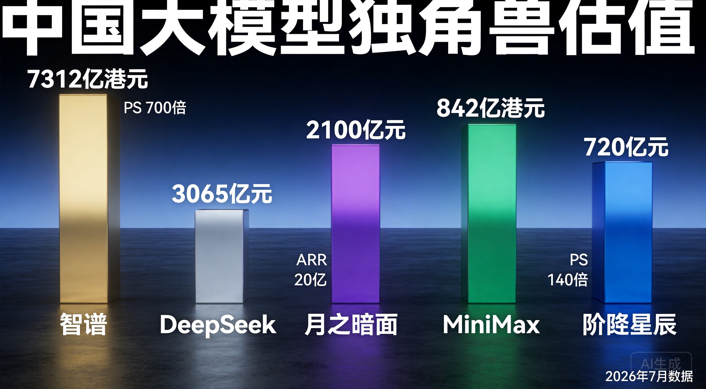

智谱的PS倍数高达700倍，是阶跃的5倍。这意味着市场对智谱的"基础模型平台"故事给出的溢价远高于阶跃的"AI+终端"路线。但阶跃140倍的PS也不算便宜了——作为一个年营收只有5亿的公司，它的估值里包含了大量对未来的透支。

### 2.7 融资军备竞赛

2026年上半年，大模型赛道融资TOP3：

1. **DeepSeek**：510亿元
2. **阶跃星辰**：230亿元（半年4轮融资）
3. **月之暗面Kimi**：189亿元

三家合计930亿元，占整个赛道融资的30%。资本正在以前所未有的速度向头部集中。

阶跃星辰的融资节奏尤其疯狂——2026年1月完成超50亿元B+轮，5月又完成近25亿美元（约170亿元）Pre-IPO轮，投资方包括华勤技术、龙旗科技、豪威集团、中兴通讯等一水儿的硬件产业链公司，以及腾讯的三轮加持。

这不是普通的财务投资，这是产业链上下游在用真金白银"预订"阶跃星辰的终端产能。

---

## 三、阶跃星辰是谁？

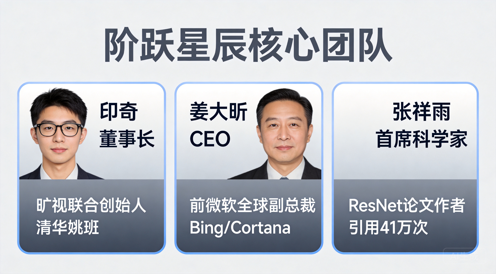

很多人可能第一次听说这家公司，但它的团队阵容堪称豪华：

- **董事长印奇**：旷视科技联合创始人，清华姚班毕业，同时也是千里科技董事长（做智能驾驶的）。他不是"空降"的，据虎嗅报道，早在阶跃星辰成立初期他就参与了战略规划。
- **CEO姜大昕**：前微软全球副总裁，做过Bing搜索引擎和Cortana的核心研发。他带的那支400多人的团队，覆盖了网页排序、智能问答、知识图谱、图片视频搜索等关键模块。
- **首席科学家张祥雨**：ResNet论文的四位作者之一。ResNet是深度学习的里程碑式论文，Google Scholar引用超过41万次。

2023年4月在上海成立，到现在刚好3年。已发布40+款自研模型，覆盖语言、多模态、推理等方向。

但真正让阶跃星辰与众不同的，不是它的模型有多强，而是它的**落地策略**：

- 国内60%头部手机品牌与阶跃星辰合作，模型装机量超过4200万台（覆盖OPPO、荣耀、中兴等）
- 与吉利合作智能座舱AgentOS，银河M9上市3个月销量近4万辆，2026年预计"上车"超100万辆
- 2025年营收近5亿元，2026年预计约12亿元

说白了，阶跃星辰不是那种只会在实验室跑分的公司。它选择了一条更重但更接地气的路——把模型塞进别人家的手机和汽车里，先让用户"用起来"。

---

## 四、大模型公司为什么要造手机？

这个问题背后的逻辑其实很残酷。

### 4.1 API商业模式碰到了天花板

中国C端用户几乎没有为AI付费的习惯。ChatGPT Plus在美国卖20美元/月，有3800万订阅用户。中国呢？大部分用户连1块钱的API调用费都不愿意出。

B端更是血海。2025年国内大模型公司只完成了22笔融资，融资频次和规模双双腰斩。资本不再为"参数故事"买单，转而对"交付能力"与"场景闭环"提出近乎苛刻的要求。API价格在一年内跌了90%以上，DeepSeek V4-Flash的API价格低到每百万Token 0.28美元，不到GPT-5.5的1%。

**卖模型不赚钱，这是事实。**

### 4.2 终端是数据和用户的入口

OpenAI如果只做模型，永远只是寄生在别人生态里的"插件"。掌控硬件终端，模型厂商才能：
- 直接触达用户，不被中间平台截流
- 合规收集物理世界的多维度数据，让AI"看懂现实"
- 定义下一代交互标准

### 4.3 中国成熟的制造生态降低了硬件门槛

这一点是关键。中国有全球最完善的手机供应链——华勤技术是全球头部手机ODM厂商，从芯片到整机的全链条制造能力，让一个软件公司"跨界造手机"的门槛大幅降低。

### 4.4 阿里云徐栋的判断说得好

"除了Chatbot和Agent之外，硬件可能是大模型快速形成商业闭环的场景。"

这句话的潜台词是：当模型能力趋同、API价格见底的时候，谁能把AI能力变成消费者愿意掏钱买的产品，谁就能活下来。

---

## 五、Step AOS和STEPX Neo——到底有什么不同？

### 5.1 不是"给手机加AI功能"，是"从底层重做操作系统"

这是最重要的区别。目前市面上绝大多数所谓的"AI手机"，本质上是在安卓系统上加一层AI功能——语音助手、AI修图、智能摘要。

阶跃星辰的Step AOS走的是完全不同的路：**从Android、Linux与RTOS底层提取重构**，打造了一套全新的操作系统架构。核心设计理念是让Agent成为系统的一等公民，而非在现有系统上叠加AI功能。

打个比方：传统AI手机是在一栋老楼里加了电梯，Step AOS是直接建了一栋新楼，电梯从地基开始就是为电梯设计的。

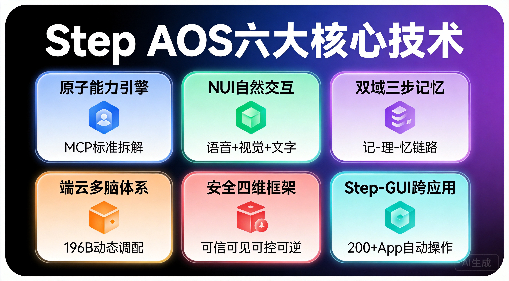

### 5.2 Step AOS六大核心技术架构

发布会上，阶跃星辰详细拆解了Step AOS的技术架构，包含六大核心模块：

**① 原子能力引擎**
以MCP（Model Context Protocol）标准将系统底层能力拆解为通讯、应用、文件、系统四大类最小单元。每个"原子能力"都是标准化的可调用接口，Agent可以像搭积木一样自由组合这些能力来完成复杂任务。

**② NUI自然交互机制**
NUI（Natural User Interface）支持语音、视觉、文字多模态输入，用户可以用最自然的方式与手机交互——说话、打字、甚至让摄像头"看"东西，都能触发AI响应。

**③ 双域三步记忆结构**
独创"用户域+智能体域"双域记忆架构，配合"记-理-忆"三步处理流程。用户域存储个人偏好和历史行为，智能体域记录任务上下文和执行经验，让AI真正"记住"你是谁、你要什么。

**④ 端云多脑体系**
STEPX Neo深度内置196B参数大模型，同时支持端云协同——依据任务复杂度动态调配不同规模的模型。简单任务在端侧瞬间完成，复杂任务自动上云调用更大算力。

**⑤ 安全框架："可信、可见、可控、可逆"四维体系**
这是Step AOS最受关注的技术亮点之一：
- **可信**：所有AI操作基于可信计算环境
- **可见**：AI的每一步决策对用户透明可查
- **可控**：权限按需授予、用完即收，不持续占用
- **可逆**：误操作支持一键撤回

**⑥ Step-GUI跨应用操作**
可跨200+款App自动操作，不是简单的语音指令，而是真正的"GUI自动化Agent"——能看懂屏幕内容，自主规划任务，跨应用执行。端侧模型的响应速度达到0.1秒级toolcall，不需要每次都等云端。

### 5.3 内置智能体：Amoo

STEPX Neo内置了阶跃星辰打造的智能体**Amoo**，作为系统级AI助手。Amoo不是一个简单的语音助手，而是基于196B端侧大模型深度驱动的全能智能体，能够调用Step AOS的原子能力引擎，跨App完成复杂任务链。

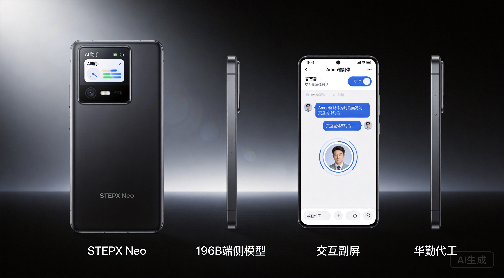

### 5.4 硬件端

- **代工厂**：华勤技术深度代工（不是简单的贴牌，而是深度联合研发）
- **渠道方**：努比亚
- **交互副屏**：机身背面配备交互副屏，提供额外的AI交互界面
- **价格**：未公布（发布会未披露售价信息）
- **发售状态**：7月13日正式发布，7月17日在WAIC（世界人工智能大会）首次公开展出。具体配置参数与发售时间尚未公布，目前并非量产发售状态

### 5.5 生态合作伙伴

发布会上确认了首批生态合作伙伴阵容，覆盖出行、生活服务、办公、社交等主要场景：

- **出行**：携程、滴滴、高德、百度地图
- **生活服务**：支付宝、美团
- **办公效率**：WPS、剪映
- **社交内容**：微博
- **搜索**：百度

这份名单基本覆盖了中国互联网生态的核心应用，说明阶跃星辰在Agent生态对接上已经做了大量前置工作。但需要注意的是，"宣布合作"和"深度开放接口"之间还有很大的距离——真正的考验在于这些App是否愿意向系统级Agent开放核心功能的API调用权限。

### 5.6 安全白皮书

发布会同步联合上海人工智能实验室发布了两份重要文件：

- **《新一代智能体系统安全技术白皮书》**
- **《端侧大模型网络安全指南》**

这两份文件从行业标准和学术层面为AI智能体终端的安全性提供了理论框架，也体现了阶跃星辰在安全合规上的前瞻布局。在AI终端这个全新品类上，安全问题将是消费者和监管部门最关注的议题之一。

### 5.7 "100天·共同定义智能体乐园"计划

阶跃星辰在发布会上启动了**"100天·共同定义智能体乐园"计划**，邀请开发者和用户共同参与定义AI智能体的使用体验。这是一个开放共创的策略——通过100天的密集迭代，收集真实用户反馈，快速打磨Agent能力和Step AOS的系统体验。

### 5.8 中美对比：谁在AI终端赛道上领先？

这是一个很有意思的对比维度：

| 玩家 | 端侧策略 | 时间线 | 核心差异 |
|------|---------|--------|---------|
| **阶跃星辰** | 自研品牌手机STEPX + Step AOS | 2026年7月发布，WAIC首秀 | 首个大模型公司独立造机 |
| **OpenAI** | 联发科定制天玑9600，Jony Ive参与设计 | 最快2027年上半年量产 | 比阶跃晚至少半年到一年 |
| **苹果** | WWDC 2026选择与Google Gemini合作 | 已落地 | 放弃自研大模型，年授权费10亿美元 |
| **Google** | Gemini Nano 4内置Pixel 10 | 2026年 | Pixel全球市占率不足2%，影响力有限 |
| **字节+中兴** | 豆包AI+中兴硬件合作模式 | 二代7月17日WAIC展示 | 非独立品牌，仅展示不开售 |

**一句话总结：在"大模型公司独立造手机"这条赛道上，中国公司跑在了美国前面。**

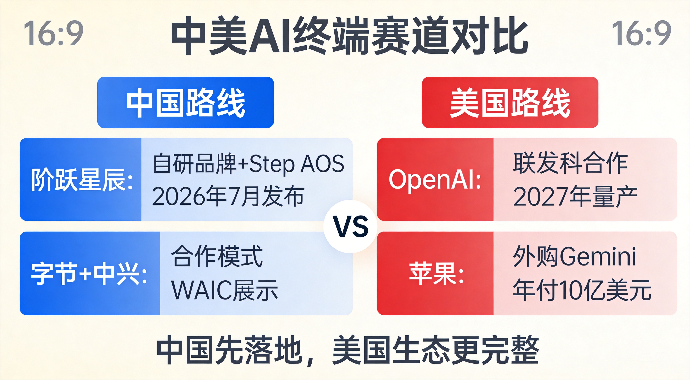

这不是因为中国技术更强，而是因为中国的手机供应链太成熟了，造手机的门槛低；而美国的AI公司强在模型和生态，硬件恰恰是短板。

---

## 六、六大端侧AI玩家全景对比

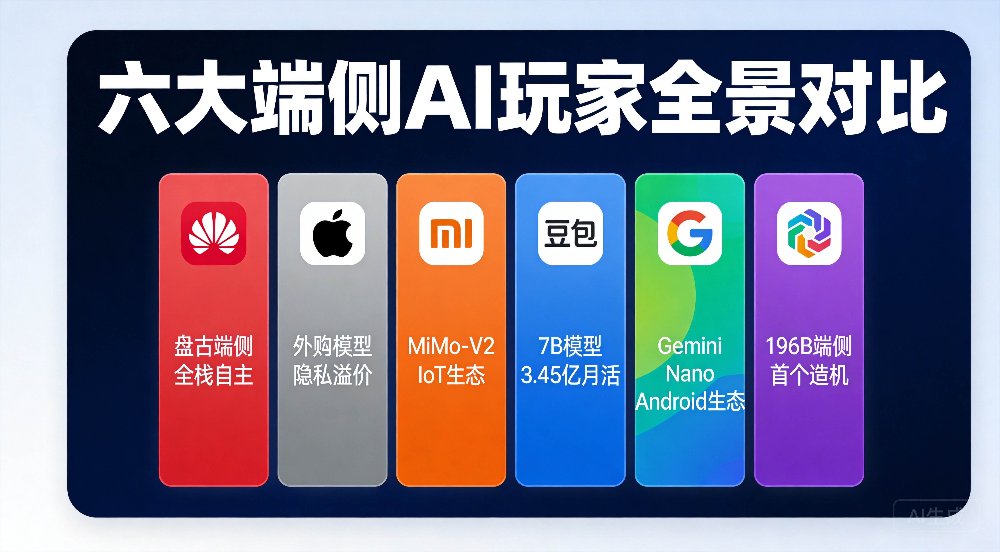

把视野拉得更广一些，目前全球端侧AI的主要玩家有六类：

| 玩家 | 端侧模型 | 终端策略 | Agent能力 | 核心差异化 |
|------|---------|---------|----------|-----------|
| 华为 | 盘古端侧 | 自研+鸿蒙 | 小艺日均30亿次唤醒 | 全栈自主（芯片+系统+模型） |
| 苹果 | 3B+外购Gemini/ChatGPT | 自研iPhone | Siri跨App | 隐私架构，品牌溢价 |
| 小米 | MiMo-V2-Pro | 自研+IoT | miclaw 50+系统工具 | IoT生态最完善 |
| 豆包（字节+中兴） | 豆包7B | 合作模式 | 跨App操作 | 3.45亿月活用户基础 |
| Google | Gemini Nano 4 | Pixel+Android | GeminiSystemService | Android生态 |
| 阶跃星辰 | 196B端侧大模型 | 自研品牌手机STEPX | Step-GUI跨200+App | 首个大模型公司独立造机，196B参数行业最高 |

六种路径，六种赌注。华为赌全栈自主，苹果赌隐私+品牌，小米赌IoT生态，字节赌用户量，Google赌Android统治力，阶跃赌的是"模型+终端"的一体化体验。

值得注意的是，阶跃星辰的196B端侧参数是目前公开信息中端侧部署的最大规模模型，这一数字远超其他玩家的端侧模型参数量。但参数大也意味着对芯片算力和功耗的更高要求，实际体验如何还需真机验证。

---

## 七、风险与挑战：冷水时间

说完激动人心的部分，该泼冷水了。

### 7.1 前车之鉴：跨界造手机，九死一生

- **锤子科技**：罗永浩带着情怀入局，最终血亏收场
- **格力手机**：董明珠说"分分钟灭掉小米"，结果成了笑话
- **字节跳动**：2019年收购锤子团队，仅推出两款手机就暂停了硬件计划

手机行业的残酷在于：它不是一个"好产品就能赢"的市场。供应链、渠道、品牌、售后、库存管理——每一个环节都是坑。

### 7.2 阶跃面临的特殊风险

**进网许可问题**：目前阶跃星辰仅取得进网试用批文，这意味着初期产量可能只有几万台。努比亚有正式许可，但量产规模也受限。

**App生态摩擦**：初代豆包手机的教训还历历在目——依赖"模拟触控"实现跨App操作，结果被微信、淘宝、支付宝识别为异常操作并封禁。二代改用MCP/A2A协议，Step AOS的原子能力引擎也是基于MCP标准设计，但核心矛盾没有解决：**系统级Agent绕开App直接操作，直接动了互联网巨头的蛋糕。** 广告收入、用户数据、商业闭环——这些都会受到威胁。

**品牌认知度为零**：普通消费者不知道阶跃星辰是谁，STEPX更是一个全新的品牌。价格未公布，但无论最终定价多少，消费者买一部手机总得知道它叫什么、售后找谁、出了问题怎么办。

**"全球首款"之争**：努比亚、荣耀也在抢"全球首款AI智能体手机"的名号。消费者对"首款"的认知窗口很短，如果多家公司同时喊"首款"，这个叙事就失效了。

**AI手机的尴尬现实**：Counterpoint数据显示，AI手机渗透率已达50%，但26%的用户从未使用过AI功能，仅7%的人愿意为AI换机。这说明"AI"作为卖点很有吸引力，但作为购买决策还不够硬。

**从发布到量产的距离**：STEPX Neo目前仅完成发布和WAIC首秀，具体配置和发售时间均未公布。从"发布"到"量产发售"之间，还有产能爬坡、品控验证、渠道铺货等大量工作要做。

**估值风险**：PS 140倍。如果AI手机的体验没有达到预期，或者App生态摩擦导致核心功能受限，估值回调的压力会非常大。

### 7.3 但也有独特优势

不能只说风险不看优势：

- **华勤深度绑定** = 成熟供应链，不是PPT造机
- **4200万台装机量** = 已经验证过的终端经验和数据闭环
- **产业资本围猎**：华勤、龙旗、豪威、中兴——从整机制造到上游核心器件的全链条都在股东名单上
- **腾讯三轮加持**：不仅是钱，还有微信生态的潜在开放
- **印奇的产业经验**：他完整经历过AI 1.0时代的创业沉浮，知道怎么把技术做成产品
- **生态合作伙伴阵容豪华**：携程、支付宝、滴滴、美团、百度、京东、WPS、剪映、高德、微博等已宣布合作
- **安全白皮书背书**：联合上海人工智能实验室发布安全标准文件，为行业树立安全基准

---

## 八、赛道预判：涨跌之间

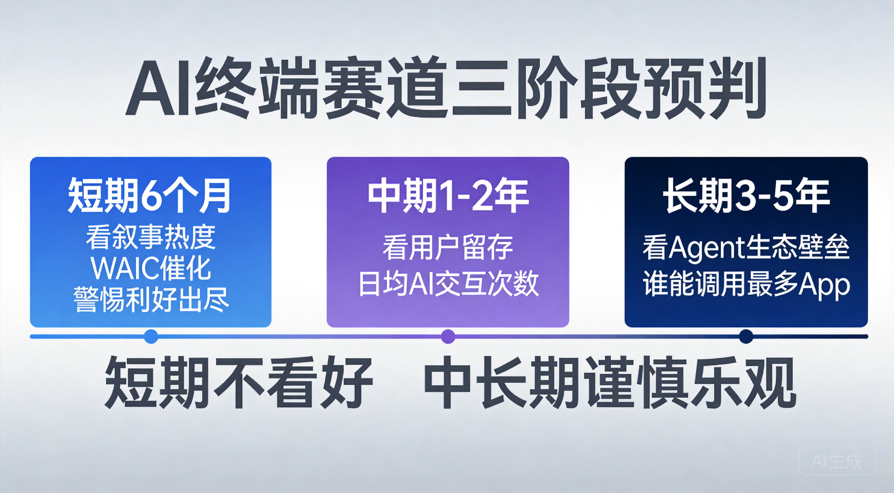

以下是赛道级判断，不涉及个股推荐。

### 8.1 AI终端赛道：三个阶段，三个赌注

- **短期（6个月）**：看叙事热度。阶跃STEPX Neo发布、WAIC首秀、"100天共同定义"计划启动、OpenAI跟进——密集的事件催化会让AI终端赛道成为市场焦点。华勤技术、中兴通讯等供应链公司会直接受益。但要警惕"利好出尽"的风险。

- **中期（1-2年）**：看用户留存。AI手机能不能让用户每天都用AI功能？如果买了之后26%的人依然不用AI，那这个故事就讲不下去了。关键指标是：日均AI交互次数、跨App任务完成率、用户主动唤醒AI的比例。

- **长期（3-5年）**：看Agent生态壁垒。最终胜出的不是硬件最好的公司，而是Agent生态最完善的公司——谁的Agent能调用最多App、完成最复杂任务、积累最多用户数据，谁就赢。

### 8.2 大模型公司造手机的成功概率

**我的判断：短期不看好，中长期谨慎乐观。**

短期不看好，是因为第一代产品一定会有各种问题——App兼容性、品牌认知、售后服务、产能爬坡。价格尚未公布，但无论最终定在什么价位，普通消费者不会因为"AI"就花大价钱买一个没听说过的牌子。

中长期谨慎乐观，是因为：
1. 手机供应链在中国太成熟了，硬件问题可以靠时间和迭代解决
2. 4200万台的装机量已经证明了"模型+终端"的模式是可行的
3. 如果App生态能谈下来（这是最大的变量），Agent的体验确实可能带来颠覆性的用户价值

### 8.3 中美AI终端赛道的差异化走向

**中国路线**：模型公司直接造硬件，或者与手机厂商深度合作。原因是中国手机供应链太强、App生态太碎片化，需要系统级Agent来统一管理。

**美国路线**：AI公司做模型+平台，硬件交给苹果、三星。OpenAI选择与联发科合作、找Jony Ive设计，但量产要到2027年。苹果选择外购模型（Gemini+ChatGPT），年付10亿美元。

**我的判断**：中国的AI终端会先落地，但美国的AI终端生态会更完整。中国的优势是快，劣势是生态碎片化和App厂商的抵制；美国的优势是生态整合能力强，劣势是硬件迭代慢。

### 8.4 最核心的变量

整篇文章看下来，决定AI终端赛道成败的最核心变量其实就一个：**App厂商愿不愿意开放接口？**

如果微信、淘宝、支付宝愿意给系统级Agent开放标准化接口（不是模拟点击，而是真正的API调用），那AI手机的体验会发生质变——你可以对手机说"帮我订一张明天去上海的机票，用我上次住的那个酒店"，然后手机自动完成从搜索到支付的完整流程。

如果App厂商继续抵制（担心被抢入口），那AI手机就只是一个"更聪明的语音助手"，不值得花大价钱。

这个博弈的结果，可能比任何模型跑分都更能决定AI终端赛道的命运。

---

## 九、写在最后

阶跃星辰造手机这件事，表面上看是一家公司的战略选择，但本质上反映了整个大模型行业的焦虑和突围。

当模型能力趋同、API价格见底、融资环境收紧，大模型公司必须找到自己的"不可替代性"。有的赌开源生态（DeepSeek），有的赌企业级市场（智谱），有的赌C端流量（月之暗面），而阶跃赌的是——**谁能把AI从云端拉到用户手里，谁就赢了下一个十年。**

STEPX Neo的发布、Step AOS的技术架构、196B端侧大模型的深度内置、Amoo智能体的亮相、豪华的生态合作伙伴阵容，以及"100天共同定义智能体乐园"计划的启动——这些都是阶跃星辰在这个赌注上亮出的底牌。

但底牌好不等于能赢。从发布到量产，从量产到用户留存，从用户留存到生态壁垒——每一步都有无数坑要踩。

这个赌注有风险，但方向是对的。

就像当年所有人都觉得特斯拉是笑话的时候，马斯克赌的是"电动车+智能化"的方向。最终他赢了，不是因为特斯拉的早期产品有多好，而是因为他赌对了方向，然后用时间和迭代把产品做对了。

阶跃星辰能不能成为AI终端领域的特斯拉？不知道。但它至少证明了一件事：大模型行业的竞争，正在从"谁的模型更强"变成"谁能把模型变成用户真正用得上的东西"。

这场终端之战，才刚刚开始。

---

## 参考来源

1. **阶跃星辰2026年7月13日发布会**：华尔街见闻、凤凰网科技、澎湃新闻、深科技等多家媒体报道——STEPX品牌发布、Step AOS系统架构、STEPX Neo硬件信息、Amoo智能体、196B端侧模型、交互副屏、生态合作伙伴名单、安全白皮书、"100天·共同定义智能体乐园"计划等信息均来自发布会官方内容及多家媒体交叉验证报道。

2. **SuperCLUE 2026年6月排行榜**：ainchina.com《The Great AI Benchmark War: How Chinese Models Caught the Frontier in 2026》（https://www.ainchina.com/blog/china-ai-benchmark-war-caught-frontier-2026/）；SuperCLUE官网（https://superclueai.com/）

3. **LMArena Elo排名（2026年7月）**：swfte.com（https://www.swfte.com/es/ai/lmarena-ai）；DataLearnerAI排行榜（https://www.web.datalearner.com/leaderboards）

4. **全球大模型市场份额**：Momentic Marketing & First Page Sage 2026年6月数据；Sensor Tower《2026 AI Status Report》（ai-damn.com报道）

5. **中国大模型市场数据**：QuestModule 2026年6月；东方财富网《全球大模型市场格局与工业大模型赛道深度分析》（https://caifuhao.eastmoney.com/news/20260611091248950380110）

6. **阶跃星辰融资与估值**：CSDN《阶跃星辰:当AI公司不再只卖模型》（https://blog.csdn.net/lanhushe/article/details/160894555）；企查查企业信息；消费日报《阶跃星辰AI智能体手机代工企业为华勤技术》

7. **阶跃星辰核心团队**：CSDN《大模型淘汰赛下半场，阶跃的底牌是什么?》（https://blog.csdn.net/Libra1313/article/details/157806574）；智东西报道；爱企查工商信息

8. **阶跃星辰AI手机发布会**：IT之家（2026年7月13日）；科创板日报；每日经济新闻；华尔街见闻；凤凰网科技；澎湃新闻

9. **Step AOS技术架构（原子能力引擎、NUI交互、双域记忆、端云多脑、安全框架）**：阶跃星辰7月13日发布会官方内容；凤凰网科技发布会详细报道

10. **安全白皮书《新一代智能体系统安全技术白皮书》《端侧大模型网络安全指南》**：阶跃星辰联合上海人工智能实验室发布，发布会官方公布

11. **生态合作伙伴信息**：阶跃星辰发布会官方公布——携程、支付宝、滴滴、美团、百度、京东、WPS、剪映、高德、微博、百度地图等

12. **196B端侧大模型参数**：阶跃星辰发布会官方公布，华尔街见闻、澎湃新闻等媒体报道交叉验证

13. **"100天·共同定义智能体乐园"计划**：阶跃星辰发布会官方公布

14. **STEPX Neo硬件信息（交互副屏、发售节奏）**：阶跃星辰发布会官方公布；7月17日WAIC首秀信息来自WAIC官方议程

15. **OpenAI AI手机计划**：郭明錤产业链调查报告（CSDN转载 https://blog.csdn.net/a924382407/article/details/160815197）；The Next Gen Tech Insider

16. **豆包手机与WAIC**：新浪新闻《字节与努比亚合作的AI智能体手机何时正式开售?》（https://k.sina.cn/article_7879995964_1d5af323c068013dl2.html）；智东西；南方都市报

17. **中国大模型独角兽估值**：证券时报《国产大模型双雄同日发声》；36氪《从580亿到万亿市值，智谱的半年狂奔》；金融界《月之暗面Kimi迈入ARR3亿美元》；凤凰WEEKLY《智谱市值突破万亿港元》

18. **AI手机渗透率数据**：Counterpoint Research 2026年报告

19. **Step-GUI技术**：GitHub仓库（https://github.com/stepfun-ai/gelab-zero）；CSDN技术解析

20. **OpenRouter全球调用量数据**：OpenRouter官方数据；CSDN《2026年AI大模型三足鼎立》

21. **阿里云徐栋观点**：财经杂志/北京商报相关报道

22. **智谱与MiniMax上市后表现**：证券时报；36氪

*注：本文所有数据截至2026年7月14日，市场变化迅速，数据可能随时间更新。部分预估数据来自第三方分析机构，仅供参考。*

---

*v2版更新说明：本版本根据2026年7月13日阶跃星辰发布会实际内容进行了全面更新，主要变更包括：终端品牌名由"阶跃终端"更新为STEPX、手机型号确认为STEPX Neo、操作系统名由"星枢OS"更新为Step AOS、新增Amoo智能体信息、新增196B端侧大模型参数、新增交互副屏硬件细节、删除9999元价格信息（改为未公布）、更新发售信息（WAIC首秀而非量产发售）、新增生态合作伙伴名单、新增安全白皮书信息、新增"100天·共同定义智能体乐园"计划、Step AOS技术架构大幅扩充。所有新增信息均经多家媒体交叉验证。*

*内容仅作科普，不构成投资建议*
